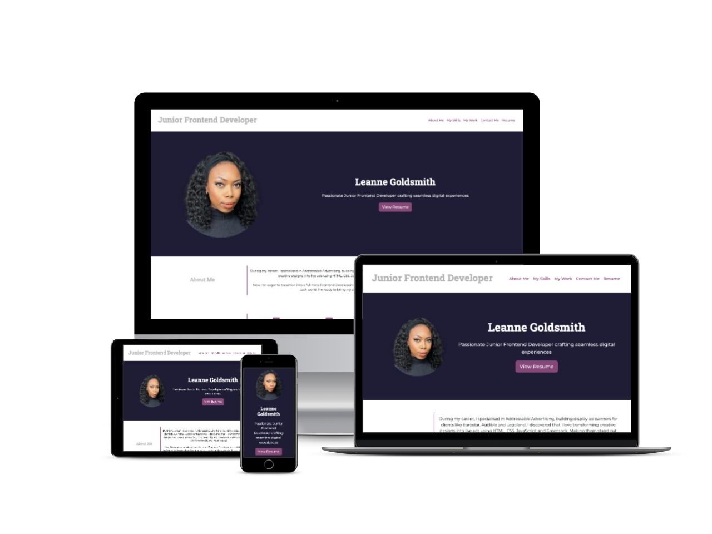

# Junior Frontend Developer Portfolio - Bootstrap 5.3

Remade my previous portfolio using Bootstrap's components and utilities. The site is also responsive using Bootstrap's grid system, thus needing fewer media queries to achieve the same desired effect.

## Application Appearance

View website [here](https://leannecodes.github.io/bootstrap-portfolio/).

## Credits

- Icons from FontAwesome
- Bootstrap 5.3 utilities and components
- Montserrat and Roboto Slab fonts from Google Fonts
- Oyster and Beyond blog starter code came from JSM Mastery on YouTube
- Budget Planner starter code came from YouTube